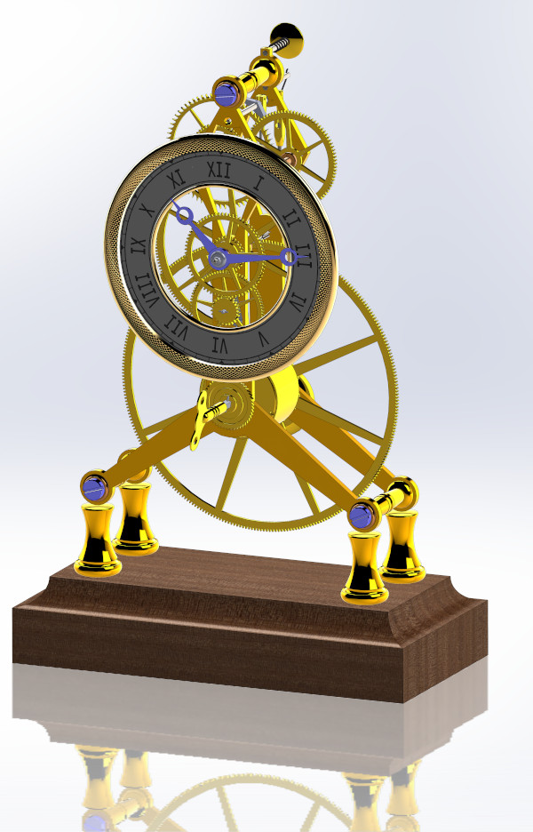

# clickspringClock
Recreate clickspring's clock in solidworks

Disclaimer: This is a student project done for fun; I'm not a professional (yet) so keep your hate. But constructive critisism is appreciated at https://www.reddit.com/r/SolidWorks/comments/jiribx/i_made_clicksprings_clock_in_solidworks/

Here is an idiot's attempt at trying /u/tootalltoby's method of using a master part in an assembly. Turned into a much bigger project than I thought it would take originally, but the master model style is great. Totally will use again.

Timelapse of about 12 hours of work: https://www.youtube.com/watch?v=UBLKGIf7gAs

If you don't know about Clickspring: https://www.youtube.com/playlist?list=PLZioPDnFPNsETq9h35dgQq80Ryx-beOli

